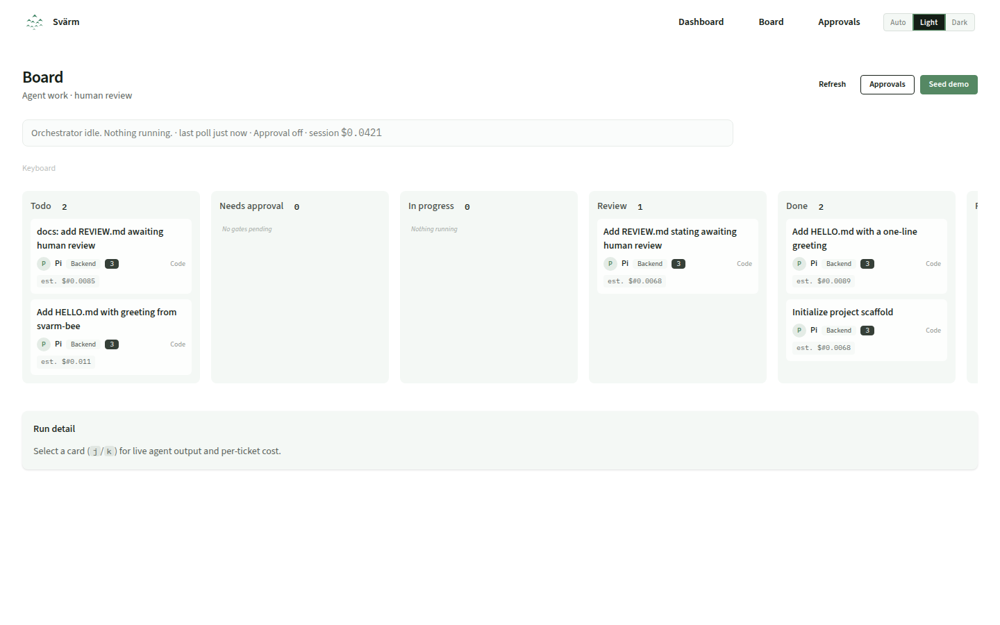
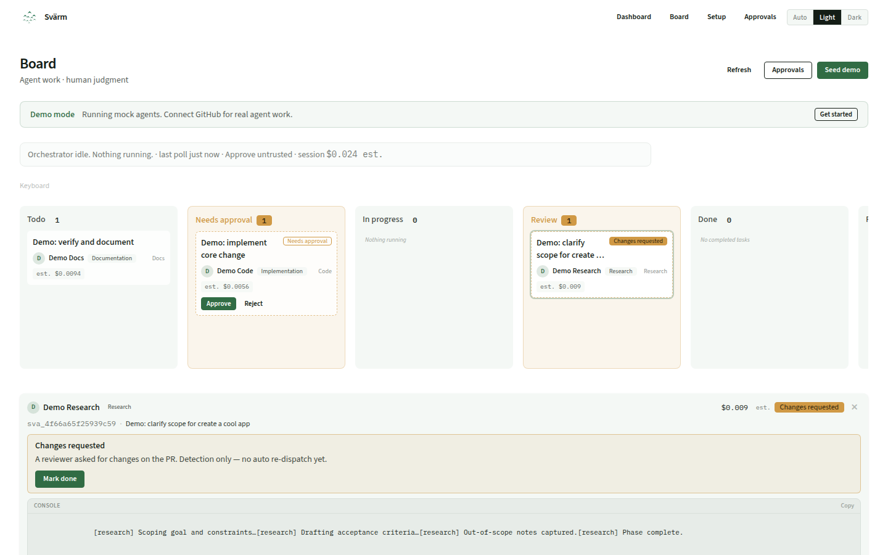
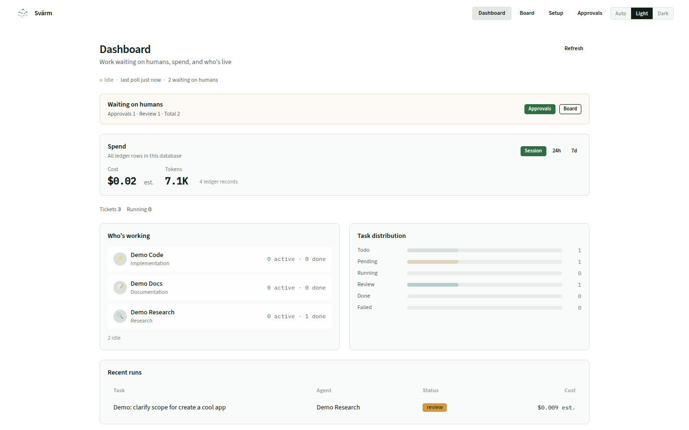

# Svärm

<p align="center">
  
</p>

**Svärm — control for your agent loop**

Self-hosted, source available (FSL-1.1-MIT → MIT after 2 years), built in Elixir.

[](https://github.com/svarm-dev/svarm/actions/workflows/ci.yml)
[](LICENSE)
[](https://elixir-lang.org)
[](https://www.erlang.org)

## Why Svärm?

You are already using AI coding agents (pi, Claude Code, Cursor, Copilot). They open PRs and touch real code. Most of that work is hard to see, hard to approve, and hard to cost.

Svärm pulls work from GitHub Issues (or a local board) and dispatches an **external** agent in a per-ticket workspace directory (path-escape guard / cwd isolation — not a chroot or container). The agent is **prompted** (WORKFLOW) to branch, push, and open a PR; Svärm itself does not create PRs. Successful runs land in `review` with a cost receipt. **Humans keep the merge button.**

- **Watch agents work.** Cards on a board with live logs and per-ticket cost.
- **Human gates.** Optional approval before dispatch; wait chips for approval and review.
- **Cost on the ticket.** Tokens, model, and dollar amount (append-only ledger; approximate rows labeled **estimated**).

## Quick start

### Docker (3 commands)

```bash
git clone https://github.com/svarm-dev/svarm.git
cd svarm
docker compose --profile demo up --build
```

`SECRET_KEY_BASE` is auto-generated on first run. Set it in `.env` for persistence across restarts.

### Elixir (if you have 1.20+ / OTP 29)

```bash
git clone https://github.com/svarm-dev/svarm.git
cd svarm
cp .env.example .env
# set SECRET_KEY_BASE: openssl rand -base64 48
mix setup
mix phx.server
```

### Open the board

| Route | What it shows |
|-------|---------------|
| [`/board`](http://localhost:4000/board) | Board with demo tasks already moving |
| [`/dashboard`](http://localhost:4000/dashboard) | Ops overview: agent roster, cost, outcomes ROI, waiting on humans |
| [`/`](http://localhost:4000/) | Instance overview (tracker, agents, workflow) |
| [`/approvals`](http://localhost:4000/approvals) | First-run gates (Basic Auth: `svarm` / `svarm` in demo) |
| [`/setup`](http://localhost:4000/setup) | Optional in-app keys + default model (same auth as `/approvals` in Docker) |

Demo agents run without API keys. They simulate work so you can see the board in action. Click **Seed demo** on `/board` to re-seed after clearing.

## Screenshots

<p align="center">
  
</p>

<p align="center">
  
</p>

<p align="center">
  
</p>

More captures under [`docs/screenshots/`](docs/screenshots/).

> [!TIP]
> Ready for real agents? [GETTING-STARTED.md](GETTING-STARTED.md) walks through GitHub + OpenRouter + pi in about 15 minutes.

## How it works

Svärm runs a control loop on your tickets:

1. **Reconcile** sync running work with the tracker
2. **Preflight** config, capacity, and approval checks
3. **Fetch** eligible issues (labels / states)
4. **Dispatch** external agent in a per-ticket workspace directory
5. **Receipt** usage comment on the issue; agent-opened PR waits for human review

Successful runs land in `review`, not `done`. Agents never merge. Each finished run can post a cost receipt (tokens, model, dollars) on the issue.

The poll loop follows the [Symphony](https://github.com/openai/symphony/blob/main/SPEC.md) agent-orchestration shape (reconcile, workspace isolation, WORKFLOW.md).

## Architecture

```
Svarm.Orchestrator (GenServer poll loop)
    ├── Svarm.Tracker  → Local (SQLite) | GitHub
    ├── Svarm.Runner   → CLI | pi RPC
    └── Svarm.Provider → OpenRouter
             │
        Svarm.Usage.Ledger (append-only cost tracking)
```

Adapters are the extension point. A new tracker is: implement `Svarm.Tracker`, register the kind in `Svarm.Tracker.Resolve`, add tests — not a fork of the orchestrator. Same idea for runners and providers. Shipped adapters are listed under Status.

## Configuration

Docker mounts `./svarm-config/` as a directory. On first boot, missing files are copied from templates. You don't need to mkdir or cp anything first.

| File | Role |
|------|------|
| `svarm-config/WORKFLOW.md` | Tracker, approvals mode, agent prompt |
| `svarm-config/agents.toml` | Agent commands, adapters, models |

<details>
<summary>Environment variables</summary>

| Variable | Purpose |
|----------|---------|
| `SECRET_KEY_BASE` | Cookie signing, required for Docker/prod (`openssl rand -base64 48`) |
| `APPROVALS_USER` / `APPROVALS_PASSWORD` | Basic Auth for `/approvals` and `/setup`; gates board approve/reject/mark-done/answer/steer/overage. **Required in production** (fail closed when unset); local Mix may stay open via `dev_routes` (see [SECURITY.md](SECURITY.md)) |
| `BOARD_AUTH_TTL_SECONDS` | Optional TTL for sticky board mutation proof after Basic Auth (default `28800` = 8h; see [SECURITY.md](SECURITY.md)) |
| `GITHUB_TOKEN` | PAT for GitHub Issues (`repo` scope) |
| `OPENROUTER_API_KEY` | LLM access for agents — must also be listed in the agent `env` block in `agents.toml` |
| `SVARM_BUDGET_MAX_USD_PER_TICKET` / `SVARM_BUDGET_MAX_USD_PER_DAY` | Optional USD caps (or WORKFLOW `budget.*`); block **new** spawns only |
| `SVARM_BUDGET_MODE` | `hard` (default: skip spawn) or `hold` (park ticket for overage approval) |
| `SVARM_BASE_URL` | Public board origin (e.g. `http://localhost:4000`); used for GitHub comment console links only when opted in |
| `SVARM_COMMENT_CONSOLE_LINKS` | Opt-in `/board?task=…&attach=1` in GitHub run comments (default **off**; board reads are unauthenticated — see [SECURITY.md](SECURITY.md)) |
| `PHX_HOST` | Public hostname for URLs + LiveView origin checks (prod) |
| `PHX_CHECK_ORIGIN` | Optional comma-separated origin allow-list (default: `//PHX_HOST`) |
| `PHX_SECURE_COOKIES` | Session Secure flag (prod default `true`; local compose sets `false` for HTTP) |
| `SVARM_SEED_DEMO=1` | Boot-seed mock tasks when board is empty (no UI button) |
| `SVARM_DEMO_ROUTES=1` | Seed demo button + `/dev/demo/seed` (Docker demo sets this) |

Empty agent `env` does **not** inherit the full host environment — list API keys explicitly in [`agents.toml`](docs/agents.md).

GitHub App identity (bot comments): [docs/github-app.md](docs/github-app.md).
</details>

## Documentation

- [GETTING-STARTED.md](GETTING-STARTED.md) full setup walkthrough
- [docs/agents.md](docs/agents.md) `agents.toml` copy-paste blocks
- [AGENTS.md](AGENTS.md) for coding agents editing this repo
- [SECURITY.md](SECURITY.md) trust model, auth, workspace isolation
- [CHANGELOG.md](CHANGELOG.md) release notes
- [CONTRIBUTING.md](CONTRIBUTING.md) how to contribute

## Status

**Current release: v0.1.6** (Review Station, Abort, Steer, GitHub Issues reliability).

**Working now:**

- Local board + GitHub Issues + pi/CLI agents + OpenRouter
- Approvals (one-shot after human approve); GitHub parks gated tickets as `status: pending-approval` (**Needs approval** / `/approvals`). Budget hold reuses that label plus `wait_reason`. Board mutations require `APPROVALS_*` in Docker/prod (**fail closed** if unset)
- Per-ticket cost (estimated labeled); optional daily/per-ticket USD caps that block **new** spawns (`hard` skip, or `hold` for a one-shot overage approval)
- **Per-agent 24h cost + retry share** — `/dashboard` roster: wall-clock 24h ledger spend (estimated labeled) and retry `retried/total` (n/a when every assigned card still has `attempts == 0`). GitHub retry counts are durable in `task_coordination`.
- Allowlisted agent child env; usage ledger export (`mix svarm.export_usage`)
- **Outcome ROI** — `/dashboard` strip with merge rate and `$/merged` over the Spend window (session/24h/7d), overall + per agent; estimated spend labeled. GitHub can count a PR as merged while the ticket is still `review` (query-time; ledger stays append-only)
- Optional **in-app `/setup`** (encrypted keys; file/env still work); human-wait visibility on board/dashboard
- **Run console** on the ticket — typed narrative/tool/run chrome, late-join from durable log, deep link `/board?task=…&attach=1`
- **Steer** — queue a mid-run note on a live **PiRPC** session from the console (same board auth as approve/answer; CLI unsupported; hidden while a Q&A is parked). Follow-up after settle is not shipped
- **Abort** — stop a live CLI or PiRPC run from the console (same board auth as approve/steer; OS kill-tree; ticket returns to Todo). Mid-run budget kill of in-flight workers is not shipped
- Optional **CI fail → fresh agent re-dispatch** with circuit breaker (default **off**; enable via WORKFLOW / `SVARM_CI_RESUME_*`)
- **Review-resume** — Changes requested chip when GitHub reviews ask for changes; optional re-dispatch on first request (default **off**; `review_resume` / `SVARM_REVIEW_RESUME_ENABLED`; shares the CI resume circuit). Empty review-column fallback is capped at 50 PR rows; a GitHub list error skips that scan
- **Review Station** — structured Evidence (PR, attempts, agent/model, cost, age) on selected review cards; PR/no-PR glance chips and a CI `pass` / `fail` / `pending` / `unknown` summary chip (N/A on the local tracker). Informational only — humans still merge on GitHub.
- **Mid-run Q&A** — a PiRPC agent can pause on a dialog; **Waiting for answer** chip + board form (confirm / select / input). CLI inject is unsupported. Dismiss or the 15-minute deadline **continues** the run.
- **Git worktree isolation** — optional `workspace.isolation: worktree` (default `path`) gives each ticket a git worktree from `workspace.git_repo`; unknown isolation values fail closed. Still directory-level isolation, not a container

**Not shipped yet:** Linear/Jira trackers, multi-provider/multi-agent registry UI, managed hosting, mid-run budget kill of in-flight workers, follow-up after settle in the console. "Adapter-ready" means the behaviours exist; it does not mean every adapter is built.

Optional UI config after the demo: open `/setup` (same auth as `/approvals` in Docker). Details: [GETTING-STARTED.md](GETTING-STARTED.md).

## Why self-hosted?

Source code and API keys stay on your machines. You can run a local tracker and keep LLM traffic on whatever provider you configure. There is no Svärm cloud in the middle of that path.

## License

Svärm is licensed under the **[Functional Source License, Version 1.1, MIT Future License](LICENSE)** ([FSL-1.1-MIT](https://fsl.software/)).

**In plain language:**

- **You can** run Svärm for your own team (homelab or company), study it, modify it, and contribute back.
- **You cannot** offer Svärm (or a substantially similar product) to others as a competing commercial product or hosted service without a commercial agreement with us.
- **Each released version** becomes **MIT** two years after we make it available.

Details: [fsl.software](https://fsl.software/).
