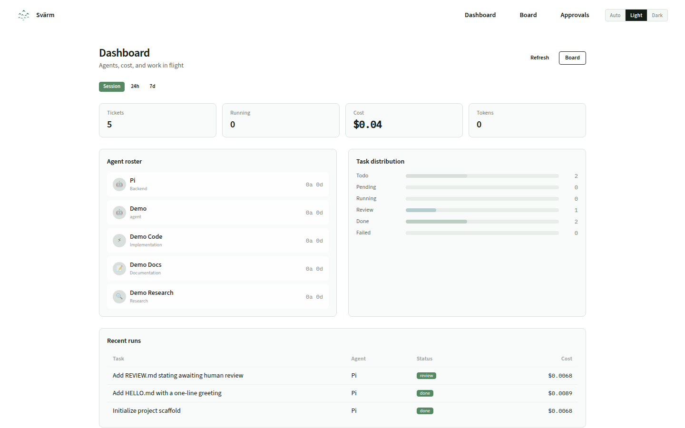

# Svärm

**The platform where engineering teams manage their human and AI members together — with auditable cost on every ticket.**

Self-hosted. Open source (MIT). Built in Elixir. Working path today: **local board + GitHub Issues + pi + OpenRouter**.

<p align="center">
  
</p>

---

## What Svärm does

Your developers are already using AI coding agents — pi, Claude Code, Cursor, Copilot. They're writing code, submitting PRs, fixing bugs. But you can't see them, govern them, or prove they're worth it.

Svärm connects tools you already use into one governed workflow:

```
GitHub Issues → Svärm orchestrator → pi / Claude Code / any agent → PR with cost receipt
                                          ↓
                                   OpenRouter / your LLM provider
```

**Watch an agent work a ticket.** Work shows up as cards on a board — not chat history.

**Governance before spend.** Which agent, which model, which budget, approved by whom.

**Auditable cost on every ticket.** Tokens, model, dollar cost — posted as a comment on the issue.

---

## Screenshots

> **Assets:** drop real captures into `docs/screenshots/` (see [docs/screenshots/README.md](docs/screenshots/README.md)). Until then the product is the running board at `/board`.

| Empty → seeded board | Running card + log | Cost receipt |
|----------------------|--------------------|--------------|
|  |  |  |

---

## Quick start — pick one path

### A) 60-second local feel (no API keys)

See agents move on `/board` without GitHub or OpenRouter.

```bash
git clone https://github.com/svarm-dev/svarm.git
cd svarm

cp .env.example .env
# SECRET_KEY_BASE — required:
#   openssl rand -base64 48

docker compose --profile demo up --build
# → http://localhost:4000/board  (3 demo tasks auto-seeded)
# → http://localhost:4000/       (this instance: tracker, agents, empty/seeded)
```

Default demo approvals Basic Auth: user `svarm` / password `svarm` (override with `APPROVALS_USER` / `APPROVALS_PASSWORD`).

**Local Elixir alternative:** `mix setup && mix phx.server` → open `/board` → **Seed demo**.

### B) Real loop on a toy repo (GitHub + pi + OpenRouter)

Full walkthrough: **[GETTING-STARTED.md](GETTING-STARTED.md)**.

```bash
cp .env.example .env
# SECRET_KEY_BASE + GITHUB_TOKEN + OPENROUTER_API_KEY + SVARM_BASE_URL

docker compose up --build
# First boot copies WORKFLOW.md + agents.toml into ./svarm-config/
# Edit svarm-config/WORKFLOW.md: kind: github, owner, repo, required_labels

# Label an issue ai-task → approve once at /approvals → watch /board
```

**Default safety:** `approval.mode: untrusted`. Real agents wait until you approve at **http://localhost:4000/approvals** (set `APPROVALS_USER` / `APPROVALS_PASSWORD` in `.env`). Demo assignees skip the gate.

### C) Harden for a team repo

After B works: GitHub App identity ([docs/github-app.md](docs/github-app.md)), keep `approval.mode: untrusted`, set real Basic Auth secrets, tighten `agents.toml` models/budgets, point `SVARM_BASE_URL` at your deploy.

---

## Dashboard

| Route | What it shows |
|-------|---------------|
| [`/`](http://localhost:4000/) | This instance — tracker, workflow path, agent count, board emptiness |
| [`/board`](http://localhost:4000/board) | Team board — status columns, live agent logs, per-ticket cost |
| [`/approvals`](http://localhost:4000/approvals) | First-run gates — approve or reject before agents touch the repo |

---

## Configuration

### `WORKFLOW.md` + `agents.toml`

Docker mounts **`./svarm-config/`** as a directory. On first boot, missing files are copied from templates — you do **not** need to `mkdir`/`cp` first.

| File | Role |
|------|------|
| `svarm-config/WORKFLOW.md` | Tracker, approvals, agent prompt |
| `svarm-config/agents.toml` | Agent commands, adapters, models |

Local Mix defaults: `priv/agents.toml` and discovered `WORKFLOW.md` / priv template.

```toml
[agent.default]
name = "Pi"
role = "Backend"
command = "pi"
adapter = "pi_rpc"
provider = "openrouter"
model = "openrouter/free"
```

### Secrets

Never put keys in config files. Use `.env` (see `.env.example`):

| Variable | Purpose |
|----------|---------|
| `SECRET_KEY_BASE` | Cookie signing — **required** for Docker/prod (`openssl rand -base64 48`) |
| `APPROVALS_USER` / `APPROVALS_PASSWORD` | Basic Auth for `/approvals` in Docker/prod |
| `GITHUB_TOKEN` | PAT mode for GitHub Issues (`repo` scope) |
| `OPENROUTER_API_KEY` | LLM access for agents / decompose |
| `SVARM_BASE_URL` | “Full run log” links in issue comments (e.g. `http://localhost:4000`) |
| `SVARM_SEED_DEMO=1` | Boot-seed mock tasks when board is empty (demo profile sets this) |

GitHub App identity (bot comments): [docs/github-app.md](docs/github-app.md).

---

## How it works

Svärm follows the [Symphony](https://github.com/openai/symphony/blob/main/SPEC.md) poll loop:

1. **Reconcile** — sync running work with the tracker  
2. **Preflight** — config + capacity checks  
3. **Fetch** — eligible issues (labels / states)  
4. **Dispatch** — agent in an isolated workspace  
5. **Receipt** — usage comment on the issue; human reviews the PR  

Successful runs land in **`review`**, not `done`. Agents never merge.

---

## Architecture
## Architecture

```
Svarm.Orchestrator (GenServer poll loop)
    ├── Svarm.Tracker  → Local (SQLite) | GitHub   (Linear/Jira: not shipped)
    ├── Svarm.Runner   → CLI | pi RPC
    └── Svarm.Provider → OpenRouter
             │
        Svarm.Usage.Ledger (append-only cost tracking)
```

Adapters are the extension point — new tracker/runner/provider = one module, not a fork.
Shipped today: **GitHub Issues + local board**, **pi / CLI**, **OpenRouter**.

---

## Why self-hosted?

- **Data stays yours** — keys and source on your infrastructure  
- **Air-gapped capable** — local tracker + local models  
- **Config-driven** — swap tracker/agent/provider via files when adapters exist  

---

## Status

**Shipped:** local board + GitHub Issues + pi/CLI + OpenRouter, with approvals and per-ticket cost receipts.

**Not shipped yet:** Linear/Jira trackers, multi-provider abstraction beyond OpenRouter, managed hosting. Don’t read “adapter-ready” as “all adapters exist.”

---

## Contributing

MIT licensed. Issues and PRs welcome.

- Operators / try path → [GETTING-STARTED.md](GETTING-STARTED.md)
- Swarm agent configs → [docs/agents.md](docs/agents.md)
- Coding agents editing **this** repo → [AGENTS.md](AGENTS.md)
- First public cut (`v0.1.1`) → [docs/release.md](docs/release.md)

---

## Learn more

- [GETTING-STARTED.md](GETTING-STARTED.md) — path B full setup  
- [docs/agents.md](docs/agents.md) — agent.toml copy-paste blocks  
- [docs/github-app.md](docs/github-app.md) — bot identity  
- [docs/screenshots/README.md](docs/screenshots/README.md) — capture board stills  
- [docs/release.md](docs/release.md) — public repo + tag checklist  
- Poll loop inspired by [Symphony SPEC](https://github.com/openai/symphony/blob/main/SPEC.md)  
